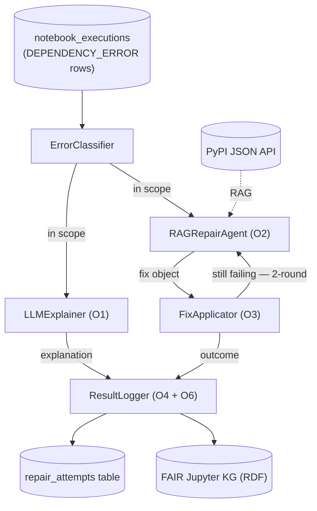

# Pipeline Architecture Note

*Updated after L3 (system architecture & component design) — June 2026.*
*Supersedes the post-L1 draft. The L1 findings are retained in §2 as problem motivation; the working dataset and integration target have moved to the Docker pipeline (see §1, §3).*

---

## 1. Pipeline lineage — what this thesis builds on

The FAIR Jupyter reproducibility pipeline has three generations. This thesis adds the third.

| Generation | What it does | Role for this thesis |
|---|---|---|
| **1. Conda pipeline** (Samuel & Mietchen, GigaScience 2024, ref [2]) | 16-step pipeline; a fresh conda env per repo; runs every notebook and logs failures. Produced the full published study. | Source of the problem-scale numbers (§2). Not the integration target. |
| **2. Docker pipeline** (Samuel et al. 2025, ref [1]; repo `Sheeba-Samuel/computational-reproducibility-pmc-docker`) | Containerizes each repo before execution, recovering many environment failures. Richer result schema (`notebook_executions`, with pre-categorized errors). | **The integration target — this thesis builds here.** |
| **3. LLM repair layer** (this thesis) | Explains and fixes the dependency failures the Docker pipeline still only *logs*. | The contribution. |

**Decision (L3):** build on the Docker pipeline. Its residual dependency failures — notebooks that fail even after containerization — are exactly the gap this thesis targets, and its schema already pre-classifies errors (see §3–§4).

---

## 2. Scale of the problem (L1 findings — motivation only)

From the full original **conda** study (every notebook executed):

- Total notebooks executed: **10,389**
- `ModuleNotFoundError`: 5,562 (53.5%)
- `ImportError`: 1,014 (9.8%)
- Combined dependency-failure target: **6,576 (63.3%)**

Top missing modules (parsed from `executions.msg`): anndata (1258), scanpy (423), pandas (177), cemba_data (176), tensorflow (149), Bio (108), fastai (103)… — dominantly biomedical, consistent with the PubMed Central origin.

**These numbers motivate the problem; they are not the working dataset.** They come from the full conda run. The dataset this thesis operates on is the Docker pipeline's dependency-error set (§3), currently a partial sample (214 targets). No fuller Docker run is available, so 214 (≈204 pip-fixable) is the working set; the 6,576 stands as evidence of scale.

---

## 3. Integration point

- **Hook-in:** immediately after the Docker pipeline writes a row into the `notebook_executions` table tagged `error_category = 'DEPENDENCY_ERROR'` (written in `scripts/nbprocess/summary.py`).
- **`DEPENDENCY_ERROR` = `ModuleNotFoundError` + `ImportError`, exactly** — the pipeline's `categorize_error_type()` maps only these two into that bucket. In the current sample: 172 + 42 = 214 rows.
- **Out of scope, dropped by the ErrorClassifier:** ~10 of the 214 are missing *system* libraries (`.so` files) needing `apt`, not `pip`. Remaining pip-fixable target ≈ 204.
- **Execution model:** a batch pass over the `DEPENDENCY_ERROR` rows (results already exist — no re-running of pipeline phases). Fixes are applied and validated **inside each repository's Docker container**, re-running the notebook top-to-bottom (a partial re-run cannot validate a fix).
- **Matching-environment principle:** failures and re-execution both happen in the Docker environment, so a success is attributable to the fix and not to a different setup.

---

## 4. Data available at the hook-in point

Per failed notebook, from `notebook_executions`:

| Field | Use |
|---|---|
| `error_type` | exception class (e.g. ModuleNotFoundError) — the "reason" |
| `error_message` | error text (short, e.g. "No module named 'scanpy'") |
| `error_category` | pre-set bucket; the trigger filter |
| `error_cell_index` | which cell failed |
| `notebook_id`, `repository_id` | links to notebook + repo |
| `notebook_name`, `url` | notebook name + GitHub URL |
| `total_code_cells`, `executed_cells` | progress before failure |

Also available: the cloned repo on disk (`requirements.txt`, the `.ipynb`), and — if the short `error_message` is insufficient — the full traceback in the legacy `executions.msg` column.

*Field-name change from the conda plan:* `reason → error_type`, `msg → error_message`, `cell → error_cell_index`.

---

## 5. System architecture — the repair layer

Five components, sequenced by an orchestrator as a **procedural pipeline** — a fixed sequence, not a self-directing agent (the design choice justified by Yang et al. [15] for batch scalability).



### Component contracts

| Component | Job | In | Out |
|---|---|---|---|
| **ErrorClassifier** | confirm in-scope + identify package | the failed-notebook record | `in_scope`, `subtype` (missing_package / wrong_version), `failing_module` |
| **LLMExplainer** (O1) | plain-language explanation | classified record + model/prompt config | `explanation_text`, `model_used` |
| **RAGRepairAgent** (O2) | propose a structured fix grounded in PyPI | classified record + requirements/imports + config; optionally a prior failed attempt | a fix object (§6.1) |
| **FixApplicator** (O3) | apply the fix, re-run, judge | fix object + the repo's container | `outcome` (fixed / still_failing / apply_error), new error if any |
| **ResultLogger** (O4+O6) | persist everything | the full accumulated record | a `repair_attempts` row (§6.2) + RDF triples (§6.3) |

### Orchestrator

- **Sequence:** for each row → ErrorClassifier → (if in scope) LLMExplainer + RAGRepairAgent → FixApplicator → ResultLogger.
- **One-round vs two-round switch (ablation e3):** if `still_failing` and two-round mode is on, feed the new error back to RAGRepairAgent once more, re-apply, then log.
- **Failure handling:** every attempt is logged even when a component errors (malformed LLM output, PyPI unreachable, re-exec timeout); one bad notebook never crashes the batch.
- **Config surface (NFR5):** model, prompt strategy, and round count are injected, so they can be swapped without code changes.

---

## 6. Data contracts

### 6.1 Fix object — RAGRepairAgent output (pip-only v1)

JSON; the *proposed* fix, before application. `replace_import` (notebook code edits) is deferred to future work.

```json
{
  "action": "pin_version",
  "import_name": "scanpy",
  "install_name": "scanpy",
  "version": "1.9.3",
  "command": "pip install scanpy==1.9.3",
  "rationale": "Notebook needs an API present only up to 1.9.x; pinning the last compatible release.",
  "pypi_evidence": {
    "latest_version": "1.10.1",
    "chosen_version": "1.9.3",
    "requires_python": ">=3.9"
  }
}
```

`action` ∈ `install | pin_version | none`. `version` is `null` for a plain install. `command` is what the FixApplicator runs inside the container.

### 6.2 `repair_attempts` table — SQLite

The validation log *and* the benchmark dataset (O4). One row per attempt (a two-round repair = two rows; different models/prompts = more rows), linked to the existing `notebook_executions`.

```sql
CREATE TABLE repair_attempts (
  id                      INTEGER PRIMARY KEY,
  notebook_execution_id   INTEGER NOT NULL,   -- FK -> notebook_executions.id (the failure being repaired)

  -- from ErrorClassifier
  failing_module          TEXT,               -- e.g. "scanpy"
  subtype                 TEXT,               -- missing_package | wrong_version

  -- from LLMExplainer (O1)
  explanation             TEXT,

  -- from RAGRepairAgent -- the proposed fix (O2)
  action                  TEXT,               -- install | pin_version | none
  install_name            TEXT,               -- resolved PyPI name
  version                 TEXT,               -- version to pin, or NULL
  command                 TEXT,               -- exact command run
  rationale               TEXT,
  pypi_evidence           TEXT,               -- JSON: versions seen, requires_python

  -- from FixApplicator -- the outcome (O3)
  outcome                 TEXT,               -- fixed | still_failing | apply_error
  new_error_type          TEXT,
  new_error_message       TEXT,

  -- run metadata (for experiments)
  llm_model               TEXT,
  prompt_strategy         TEXT,               -- for the L4 prompt comparison
  round                   INTEGER,            -- 1 or 2 (the ablation)
  run_id                  TEXT,               -- groups one run / config
  created_at              TEXT,

  FOREIGN KEY (notebook_execution_id) REFERENCES notebook_executions(id)
);
```

### 6.3 KG enrichment — RML mapping → RDF (O6)

The FAIR Jupyter KG is generated from per-table RML mappings (`.rml.ttl`) run by `run_fairjupyter_kg.sh`. O6 = add one mapping, `repair_attempts.rml.ttl`, modeled on the existing `mapping/rml_mapping/executions.rml.ttl`. It re-expresses each repair row as triples and links them to the notebook node already in the graph — so the repair history is queryable alongside the existing reproducibility data.

Vocabulary (per L2 notes): *reuse* existing `repr:` terms where they fit (e.g. `repr:exception`), *add* new `repr:` terms for repair-specific facts, and use *PROV-O* for the activity/agent/time layer. Namespace `repr:` = `https://w3id.org/reproduceme/`; serialization Turtle (`.ttl`).

Example triples for one repair:

```turtle
repr:notebook_512  repr:hadRepairAttempt  repr:repairattempt_001 .

repr:repairattempt_001
    a                       prov:Activity, repr:RepairAttempt ;
    repr:exception          "ModuleNotFoundError" ;          # reused term
    repr:failingModule      "scanpy" ;                       # new term
    repr:appliedFix         "pip install scanpy==1.9.3" ;    # new term
    repr:fixOutcome         "fixed" ;                        # new term
    prov:wasAssociatedWith  repr:codellama_13b ;             # which model
    prov:endedAtTime        "2026-07-15T14:22:00Z"^^xsd:dateTime .
```

---

## 7. Scope decisions (v1)

- **Target error types:** `ModuleNotFoundError`, `ImportError` (= `DEPENDENCY_ERROR`).
- **Fix actions (pip-only v1):** `install`, `pin_version`, `none`. `replace_import` = future work.
- **Working dataset:** the Docker pipeline's 214 dependency errors (≈204 pip-fixable). No fuller Docker run exists; supplementing with the Grotov buggy-notebook dataset is a fallback if more volume is needed for evaluation.

---

## 8. Mapping to thesis objectives

| Objective | Realized by | Status after L3 |
|---|---|---|
| O1 — Error explanation | LLMExplainer | designed |
| O2 — Fix generation (PyPI RAG) | RAGRepairAgent + fix object (§6.1) | designed (RAG internals → L5) |
| O3 — Fix validation | FixApplicator (re-run in container) | designed |
| O4 — Benchmark dataset | `repair_attempts` table (§6.2) | schema designed |
| O5 — Pipeline integration | orchestrator + hook-in (§3, §5) | designed |
| O6 — KG enrichment | `repair_attempts.rml.ttl` (§6.3) | designed |

---

## 9. Open items

- Confirm notebook-ID alignment between the Docker data and the FAIR Jupyter KG's notebook IDs (needed for §6.3 linking — KG notebooks derive from the original conda data).
- Prompt internals (L4) and PyPI RAG internals (L5) are intentionally left out of this note — L3 fixes contracts only.