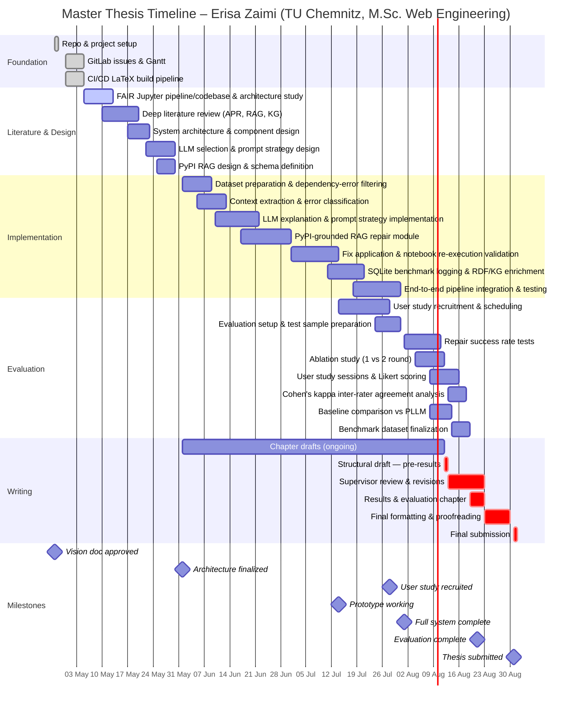

```mermaid
gantt
    title Master Thesis Timeline – Erisa Zaimi (TU Chemnitz, M.Sc. Web Engineering)
    dateFormat  YYYY-MM-DD
    axisFormat  %d %b

    section Foundation
    Repo & project setup                  :done,    f1, 2026-04-27, 1d
    GitLab issues & Gantt                 :done,    f2, 2026-04-30, 5d
    CI/CD LaTeX build pipeline            :done,    f3, 2026-04-30, 5d

    section Literature & Design
    FAIR Jupyter pipeline/codebase & architecture study :active,  l1, 2026-05-05, 8d
    Deep literature review (APR, RAG, KG)               :         l2, 2026-05-10, 10d
    System architecture & component design              :         l3, 2026-05-17, 6d
    LLM selection & prompt strategy design              :         l4, 2026-05-22, 8d
    PyPI RAG design & schema definition                 :         l5, 2026-05-25, 5d

    section Implementation
    Dataset preparation & dependency-error filtering        :         i1, 2026-06-01, 8d
    Context extraction & error classification               :         i2, 2026-06-05, 8d
    LLM explanation & prompt strategy implementation        :         i3, 2026-06-10, 12d
    PyPI-grounded RAG repair module                         :         i4, 2026-06-17, 14d
    Fix application & notebook re-execution validation      :         i5, 2026-07-01, 13d
    SQLite benchmark logging & RDF/KG enrichment            :         i6, 2026-07-11, 10d
    End-to-end pipeline integration & testing               :         i7, 2026-07-18, 13d

    section Evaluation
    User study recruitment & scheduling                  :         e0, 2026-07-14, 14d
    Evaluation setup & test sample preparation           :         e1, 2026-07-24, 7d
    Repair success rate tests                            :         e2, 2026-08-01, 10d
    Ablation study (1 vs 2 round)                        :         e3, 2026-08-04, 8d
    User study sessions & Likert scoring                 :         e4, 2026-08-08, 8d
    Cohen's kappa inter-rater agreement analysis         :         e5, 2026-08-13, 5d
    Baseline comparison vs PLLM                          :         e6, 2026-08-08, 6d
    Benchmark dataset finalization                       :         e7, 2026-08-14, 5d

    section Writing
    Chapter drafts (ongoing)                        :         w1, 2026-06-01, 72d
    Structural draft — pre-results                  :crit,    w2, 2026-08-12, 1d
    Supervisor review & revisions                   :crit,    w3, 2026-08-13, 10d
    Results & evaluation chapter                    :crit,    w4, 2026-08-19, 4d
    Final formatting & proofreading                 :crit,    w5, 2026-08-23, 7d
    Final submission                                :crit,    w6, 2026-08-31, 1d

    section Milestones
    Vision doc approved             :milestone, m1, 2026-04-27, 0d
    Architecture finalized          :milestone, m2, 2026-06-01, 0d
    User study recruited            :milestone, m3, 2026-07-28, 0d
    Prototype working               :milestone, m4, 2026-07-14, 0d
    Full system complete            :milestone, m5, 2026-08-01, 0d
    Evaluation complete             :milestone, m6, 2026-08-21, 0d
    Thesis submitted                :milestone, m7, 2026-08-31, 0d
```
