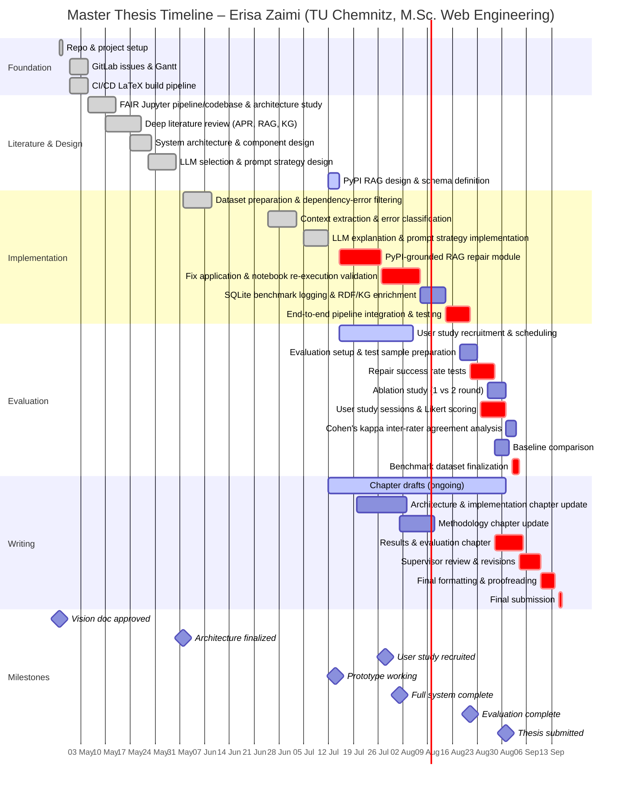

```mermaid
gantt
    title Master Thesis Timeline – Erisa Zaimi (TU Chemnitz, M.Sc. Web Engineering)
    dateFormat  YYYY-MM-DD
    axisFormat  %d %b

     section Foundation
    Repo & project setup                  :done, f1, 2026-04-27, 1d
    GitLab issues & Gantt                 :done, f2, 2026-04-30, 5d
    CI/CD LaTeX build pipeline            :done, f3, 2026-04-30, 5d

    section Literature & Design
    FAIR Jupyter pipeline/codebase & architecture study :done,   l1, 2026-05-05, 8d
    Deep literature review (APR, RAG, KG)               :done,   l2, 2026-05-10, 10d
    System architecture & component design              :done,   l3, 2026-05-17, 6d
    LLM selection & prompt strategy design              :done,   l4, 2026-05-22, 8d
    PyPI RAG design & schema definition                 :active, l5, 2026-07-12, 3d

    section Implementation
    Dataset preparation & dependency-error filtering        :done, i1, 2026-06-01, 8d
    Context extraction & error classification               :done, i2, 2026-06-25, 8d
    LLM explanation & prompt strategy implementation        :done, i3, 2026-07-05, 7d
    PyPI-grounded RAG repair module                         :crit, i4, 2026-07-15, 12d
    Fix application & notebook re-execution validation      :crit, i5, 2026-07-27, 11d
    SQLite benchmark logging & RDF/KG enrichment            :      i6, 2026-08-07, 7d
    End-to-end pipeline integration & testing               :crit, i7, 2026-08-14, 7d

    section Evaluation
    User study recruitment & scheduling                  :active, e0, 2026-07-15, 21d
    Evaluation setup & test sample preparation           :        e1, 2026-08-18, 5d
    Repair success rate tests                            :crit,   e2, 2026-08-21, 7d
    Ablation study (1 vs 2 round)                        :        e3, 2026-08-26, 5d
    User study sessions & Likert scoring                 :crit,   e4, 2026-08-24, 7d
    Cohen's kappa inter-rater agreement analysis         :        e5, 2026-08-31, 3d
    Baseline comparison                                  :        e6, 2026-08-28, 4d
    Benchmark dataset finalization                       :crit,   e7, 2026-09-02, 2d

    section Writing
    Chapter drafts (ongoing)                        :active, w1, 2026-07-12, 50d
    Architecture & implementation chapter update     :        w2, 2026-07-20, 14d
    Methodology chapter update                       :        w3, 2026-08-01, 10d
    Results & evaluation chapter                     :crit,   w4, 2026-08-28, 8d
    Supervisor review & revisions                    :crit,   w5, 2026-09-04, 6d
    Final formatting & proofreading                  :crit,   w6, 2026-09-10, 4d
    Final submission                                 :crit,   w7, 2026-09-15, 1d

    section Milestones
    Vision doc approved             :milestone, m1, 2026-04-27, 0d
    Architecture finalized          :milestone, m2, 2026-06-01, 0d
    User study recruited            :milestone, m3, 2026-07-28, 0d
    Prototype working               :milestone, m4, 2026-07-14, 0d
    Full system complete            :milestone, m5, 2026-08-01, 0d
    Evaluation complete             :milestone, m6, 2026-08-21, 0d
    Thesis submitted                :milestone, m7, 2026-08-31, 0d
```
